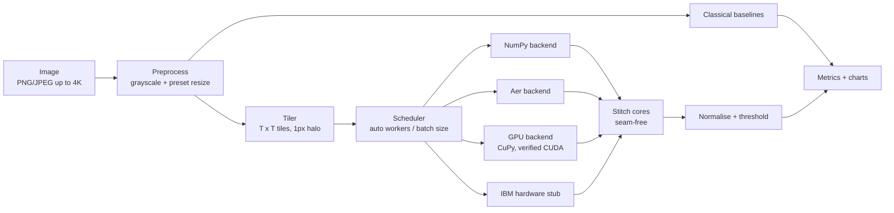

# Quantum Bits

**Hybrid quantum-classical edge detection with Quantum Hadamard Edge Detection (QHED), scaled
to 4K images by tiling.**

Quantum Bits splits an image into small tiles and amplitude-encodes each tile into a few qubits. It
then runs the QHED circuit (Yao et al., 2017) on every tile and stitches the responses into a
full-resolution edge map. Circuit size depends only on the tile, never on the image: a 4K frame
needs more circuits, not bigger ones. A Streamlit app shows the quantum result beside Sobel,
Prewitt, Canny and Laplacian, with metrics, charts and an architecture view.


## Quickstart

Requires [uv](https://docs.astral.sh/uv/) and Python 3.11+.

```bash
uv sync
uv run streamlit run app/streamlit_app.py
```

For CUDA acceleration, install the optional CuPy CUDA 13 package:

```bash
uv sync --extra gpu
```

The app runs a real CuPy kernel before enabling the CUDA GPU option. If CuPy, CUDA headers,
or a usable device are unavailable, the option is disabled instead of silently using the CPU.

The app opens with a bundled sample image. Upload any PNG or JPEG up to 3840x2160 to process
your own.

Other entry points:

```bash
uv run python scripts/demo.py --scaling   # end-to-end demo + benchmarks, writes outputs/
just test        # fast tests          (install just: uv tool install rust-just)
just test-all    # including the 4K end-to-end test
just lint        # ruff + format check + mypy
just cov         # coverage report (fails under 80%)
```

## How QHED works here

For one `T x T` tile with `N = T^2` pixels and `n = log2(N)` data qubits:

1. **Encode.** Flatten the tile row-major, L2-normalise it, and prepare it as the amplitudes
   `|c>` of `n` qubits. Keep the norm for later.
2. **Ancilla.** Add one ancilla qubit (the least-significant qubit) in `|+>`.
3. **Shift.** Apply the cyclic decrement permutation `|k> -> |k-1>` on all `n + 1` qubits,
   built from multi-controlled X gates.
4. **Interfere.** Apply a Hadamard to the ancilla. The ancilla=`|1>` amplitudes are now
   `(c_i - c_{i+1}) / 2`, the neighbour differences.
5. **Both directions.** Run once on the tile (horizontal) and once on its transpose
   (vertical), rescale by `2 * norm`, drop wrap-around terms, and combine as
   `edge = sqrt(h^2 + v^2)`.

There are two interchangeable implementations of the same math:

| Path | What it is | Used for |
|---|---|---|
| `fast` (`quantum/qhed_fast.py`) | Exact NumPy statevector simulation, vectorised over thousands of tiles | Real images up to 4K |
| `circuit` (`quantum/qhed_circuit.py`) | Real Qiskit circuits on Aer, in statevector or shot-based mode | Proving the fast path is faithful; small images |

A test asserts that both paths agree to within 1e-8 on random tiles.

## Architecture



```
src/q_edge/
  quantum/     encoding.py, qhed_fast.py, qhed_circuit.py
  tiling/      tiler.py           stride T-1 tiles with a 1px halo, exact stitch-back
  backends/    base.py            Backend Protocol + registry
               numpy_backend.py, aer_backend.py, gpu_backend.py, hardware_stub.py
  scheduler/   executor.py        chunked thread/process pool with bounded in-flight batches
               resources.py       CPU/RAM/GPU detection, auto tile/worker/batch sizing
  classical/   sobel.py, prewitt.py, canny.py, laplacian.py
  metrics/     quality.py         SSIM, PSNR, precision/recall/F1 with pixel tolerance, density
               perf.py            wall time, throughput, peak memory
  benchmark.py benchmark() and scaling_benchmark() -> pandas DataFrames
  pipeline.py  load -> preprocess -> tile -> backend -> stitch -> normalise -> threshold
  config.py    QEdgeConfig (tile size, backend, workers, shots, threshold, preset)
  ui.py, charts.py              framework-free helpers for the Streamlit app
app/streamlit_app.py            the UI
scripts/demo.py                 end-to-end demo
```

**Scalability properties:**

- **Resolution-independent circuits.** 4x4, 8x8 and 16x16 tiles need 5, 7 and 9 qubits at any
  image size.
- **Seam-free tiling.** Tiles overlap by one pixel (stride `T - 1`), and each tile contributes
  a `(T-1) x (T-1)` core. The stitched result equals the untiled computation exactly; tests
  verify this on odd sizes too.
- **Pluggable backends.** Every backend implements `run_tiles(batch) -> responses`. A new
  backend calls `register_backend` and needs no pipeline change; a test checks this.
- **Embarrassingly parallel.** Tiles are independent. The executor processes chunked batches
  with a bounded number in flight, so memory stays flat at 4K.

## Benchmark results

Development machine: Windows, Python 3.12.15, NumPy 2.5.3, CuPy 14.2.0, CUDA 13.4,
NVIDIA GeForce RTX 3050 6GB Laptop GPU, one worker. Each CPU/GPU row uses one warm-up and
three timed runs; the reported time is the median. Full methodology is in
[`docs/BENCHMARK.md`](docs/BENCHMARK.md).

**Runtime versus resolution** (synthetic scenes, seconds):

| Resolution | Megapixels | Tiles | NumPy QHED (s) | CUDA QHED (s) | Speedup |
|---|---|---|---|---|---|
| 512x512 | 0.2621 | 5,476 | 0.040782 | 0.010332 | 3.95x |
| 1280x720 | 0.9216 | 18,849 | 0.232143 | 0.050653 | 4.58x |
| 1920x1080 | 2.0736 | 42,625 | 0.310411 | 0.065478 | 4.74x |
| 3840x2160 | 8.2944 | 169,641 | 0.621703 | 0.236522 | 2.63x |

The 4K run processes 169,641 halo tiles. These results show CUDA acceleration of the classical
simulation, not quantum advantage, and are specific to this hardware and one-worker setup.

**Quality on synthetic 1080p with ground-truth edges:**

| Method | F1 (1px tolerance) | SSIM | PSNR (dB) |
|---|---|---|---|
| QHED | 1.000 | 0.991 | 30.3 |
| Sobel | 0.993 | 0.985 | 26.3 |
| Prewitt | 0.982 | 0.984 | 25.9 |
| Canny | 1.000 | 0.994 | 30.3 |
| Laplacian | 0.974 | 0.981 | 26.6 |

**Fast vs circuit:** on a 64x64 crop with 4x4 tiles, the maximum absolute difference between
the NumPy path and real Aer circuits is 5.76e-12 (Aer took ~12.0 s).

**CUDA validation:** on an NVIDIA GeForce RTX 3050 6GB Laptop GPU (compute capability 8.6,
CuPy 14.2.0, CUDA toolkit 13.4), the real CuPy backend produced a maximum absolute error of
4.44e-16 against NumPy on 128 16x16 tiles. In a fresh three-run median benchmark with one
worker, CUDA reached 25.373 MP/s at 512x512, 31.669 MP/s at 1920x1080, and 35.068 MP/s at
3840x2160. NumPy reached 6.428, 6.680, and 13.341 MP/s, respectively, for measured speedups
of 3.95x, 4.74x, and 2.63x. See the complete methodology and tables in
[`docs/BENCHMARK.md`](docs/BENCHMARK.md).

## Limitations

- **No quantum advantage.** The quantum path is simulated, and simulation is slower than
  classical filters.
- **The synthetic ground truth favours QHED.** It marks the pixel where a forward difference
  fires, so QHED's perfect F1 there means "correct", not "better". 3x3 classical operators
  produce wider edges.
- **No ground truth for uploads.** Uploaded photos are scored against Canny, so Canny scores
  F1 = 1 by construction.
- **Real hardware costs are not modelled.** Amplitude encoding needs deep state-preparation
  circuits, and reading out all differences needs many shots per tile. Shot noise is
  simulated (`shots=` on the Aer backend), but device noise is not.
- **The Aer backend is slow.** It simulates two circuits per tile, so the app limits it to
  images of at most 64 px and 4x4 tiles.
- **CUDA acceleration requires the optional `gpu` extra.** Selected GPU execution reports an
  explicit capability error rather than falling back to NumPy.
- **The CUDA benchmark is not a maximum-CPU comparison.** The reported CPU baseline uses one
  worker, and GPU performance varies with transfers, batching, driver, CUDA version, and
  competing GPU workloads.
- **The hardware backend is a stub.** It raises `NotConfiguredError`, and the app makes no
  network calls.

## Roadmap

1. **Hardware:** an IBM Runtime backend using SamplerV2 batches behind the existing protocol.
2. **Noise mitigation:** readout mitigation, zero-noise extrapolation and cheaper state
   preparation.
3. **Real-time video:** per-frame tiling that recomputes only changed tiles, on the GPU backend.
4. **Distributed:** tile batches sent to a Ray/Dask cluster or to several QPUs.

See [DECISIONS.md](DECISIONS.md) for the design choices and defaults, and [docs/](docs/README.md) for
the full documentation set (usage walkthrough with screenshots, features, architecture, API,
roadmap and optimisations).

## Reference

X.-W. Yao et al., "Quantum Image Processing and Its Application to Edge Detection: Theory and
Experiment", *Physical Review X* 7, 031041 (2017).
