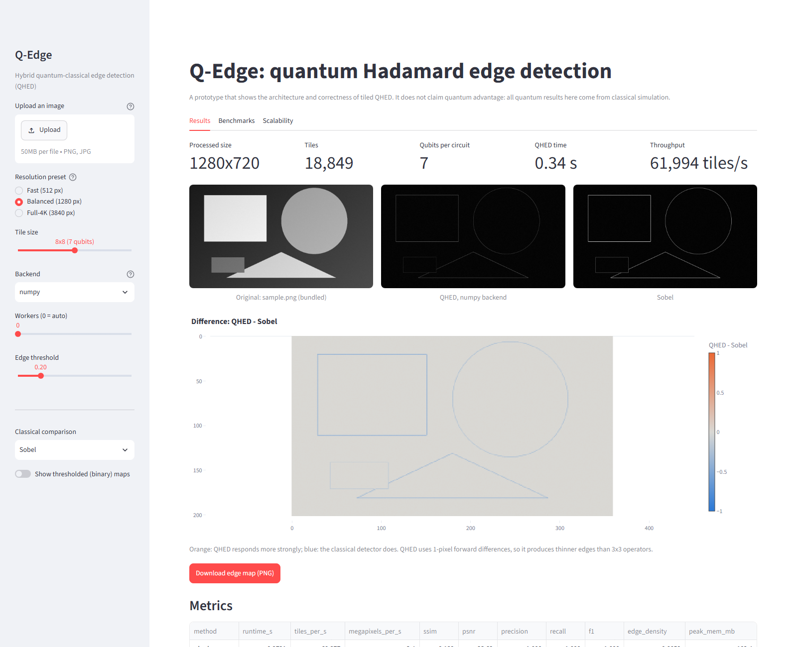

# Q-Edge documentation

Q-Edge is a hackathon prototype for hybrid quantum-classical edge detection. It uses Quantum
Hadamard Edge Detection (QHED) on small image tiles, so the circuit size stays fixed while images
scale up to 4K. A Streamlit app compares the quantum result with classical detectors.

> All quantum results here come from classical simulation. The prototype shows the architecture,
> correctness and scaling behaviour. It does **not** claim quantum advantage.

## Contents

| Document | What it covers |
|---|---|
| [usage.md](usage.md) | Installing, launching and using the app, with screenshots of every screen |
| [features.md](features.md) | Complete feature list: algorithm, pipeline, backends, metrics, UI, hardening |
| [architecture.md](architecture.md) | Components, data flow, the QHED math, tiling scheme, concurrency, design decisions |
| [api.md](api.md) | Python API reference: every public module, class and function with its file path |
| [development.md](development.md) | Tooling, tests, quality gates, project history and how to regenerate screenshots |
| [future/roadmap.md](future/roadmap.md) | Future direction: hardware, noise mitigation, video, distributed execution |
| [future/optimizations.md](future/optimizations.md) | Concrete performance and quality improvements, with expected impact |
| [screenshots/](screenshots/) | Captures of the running UI |

## Quick start

```bash
uv sync
uv run streamlit run app/streamlit_app.py
```

Then open http://localhost:8501.



## Status at a glance

| Area | Status |
|---|---|
| QHED fast path (NumPy) and circuit path (Qiskit Aer) | Done; agree to about 1e-11 |
| Seam-free tiling up to 3840x2160 | Done; a 4K frame takes about 1 s |
| Backends: NumPy, Aer, GPU (verified CuPy CUDA), IBM hardware stub | Done; GPU validated on RTX 3050 |
| Classical baselines and metrics | Done |
| Streamlit app | Done |
| Tests | 165 passing, about 98% coverage, ruff and mypy clean |

See also the project [README](../README.md) and [DECISIONS.md](../DECISIONS.md).
