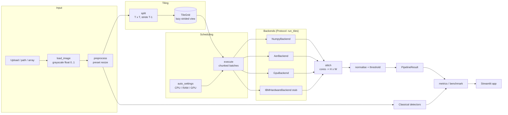

# Architecture

## 1. Design goals

1. **Bounded circuits.** No circuit ever grows with the image. The circuit size depends only
   on the tile size.
2. **Resolution independence.** Image size changes the number of tiles, nothing else.
3. **Pluggable execution.** Simulators, GPUs and real hardware sit behind one protocol.
4. **Embarrassingly parallel.** Tiles are independent and are processed in chunked batches.
5. **Provable correctness.** A fast path and a real-circuit path compute the same unitary, and
   tests check that they agree.
6. **Honesty.** Simulation is measured and reported as slower than classical filters.

## 2. Component map



| Layer | Package | Responsibility |
|---|---|---|
| Quantum core | `q_edge.quantum` | Encoding, the QHED unitary (fast and circuit), orientation handling |
| Tiling | `q_edge.tiling` | Splitting with a halo, lazy batching, exact stitching |
| Backends | `q_edge.backends` | Protocol, registry and the four implementations |
| Scheduler | `q_edge.scheduler` | Resource detection, auto-configuration, parallel execution |
| Classical | `q_edge.classical` | OpenCV baselines |
| Metrics | `q_edge.metrics`, `q_edge.benchmark` | Quality and performance measurement, DataFrames |
| Orchestration | `q_edge.pipeline`, `q_edge.config` | The end-to-end flow and configuration |
| Presentation | `q_edge.ui`, `q_edge.charts`, `app/` | Framework-free helpers, Plotly figures, the Streamlit app |

Dependencies point downward only. The pipeline depends on the backend *protocol* and registry,
never on a specific backend. The UI depends on the pipeline, not the other way round.

## 3. The QHED algorithm as implemented

For a tile with `N = T^2` pixels `c_0 ... c_{N-1}` and `n = log2 N` data qubits:

| Step | Operation | State |
|---|---|---|
| 1 | Normalise: `a_i = c_i / ||c||` | `sum_i a_i \|i>` on the data qubits |
| 2 | Ancilla (qubit 0, least significant) in `\|+>` | `sum_i a_i \|i>(\|0> + \|1>)/sqrt2` |
| 3 | Decrement `\|k> -> \|k-1 mod 2N>` on all `n+1` qubits | pairs `(a_i, a_{i+1})` meet at index `2i, 2i+1` |
| 4 | Hadamard on the ancilla | odd amplitudes are `(a_i - a_{i+1}) / 2` |
| 5 | Rescale by `2 * ||c||` | raw differences `c_i - c_{i+1}` |

- **Horizontal** differences come from the row-major tile and **vertical** ones from its
  transpose. Wrap-around terms that cross a row boundary, and the last-to-first term, are
  dropped.
- **Decrement circuit:** `X(q0)`, then for `j = 1..n`, an `MCX(controls q0..q_{j-1}, target q_j)`.
  After the lower bits flip, they are all 1 exactly when they were all 0 before. A test checks
  the resulting unitary against the cyclic-shift permutation.
- **Fast path:** `np.repeat` (ancilla), `np.roll(-1)` (decrement) and a pairwise
  sum/difference (Hadamard), applied to `(B, 2N)` arrays at once.
- **Shot mode:** probabilities give `|a_i - a_{i+1}|^2 / 4`. The sign is lost, which does not
  matter because the edge magnitude is `sqrt(h^2 + v^2)`.
- **Global phase:** Aer statevectors are rotated to real values and sign-fixed using the
  `|+>`-branch amplitudes, which are non-negative for image data.

## 4. Tiling scheme

```
stride = T - 1
rows   = ceil(H / stride)          cols = ceil(W / stride)
padded = edge-pad image to (rows*stride + 1) x (cols*stride + 1)
tile(r, c) = padded[r*stride : r*stride + T, c*stride : c*stride + T]
core(r, c) = response[0:T-1, 0:T-1]  -> placed at [r*stride, c*stride]
```

Every neighbour pair `(x, x+1)` sits inside at least one tile, so every difference is
computed. Cores do not overlap, so stitching is a pure reshape and transpose. The stitched map
equals the global forward-difference gradient with edge replication; tests check this on
sizes such as 37x53, 2x9 and 129x77.

| Resolution | 4x4 tiles (5 qubits) | 8x8 (7 qubits) | 16x16 (9 qubits) |
|---|---|---|---|
| 640x360 | 25,680 | 4,784 | 1,032 |
| 1280x720 | 102,480 | 18,849 | 4,128 |
| 1920x1080 | 230,400 | 42,625 | 9,216 |
| 3840x2160 | 921,600 | 169,641 | 36,864 |

The halo costs `T^2 / (T-1)^2` extra pixel work: 1.78x for 4x4, 1.31x for 8x8, 1.14x for 16x16.

## 5. Execution and concurrency

```mermaid
sequenceDiagram
  participant P as run_pipeline
  participant E as execute
  participant W as Worker pool
  participant B as Backend
  P->>E: grid, backend, workers, batch_size
  loop until all ranges are submitted
    E->>E: wait while in-flight >= 2 x workers
    E->>W: submit(batch(start, stop))
    W->>B: run_tiles(tiles)
    B-->>W: cores
    W-->>E: future done
    E->>E: cores[start:stop] = result; progress(done, total)
  end
  E-->>P: stacked cores (grid order)
```

- **Thread pool by default.** NumPy releases the GIL, and threads avoid pickling batches. On
  4K: 1.1 s with threads, 1.7 s serial, 3.2 s with processes.
- **Bounded in-flight work** (2 batches per worker) keeps peak memory flat.
- **Deterministic output.** Results are written by index, so parallel output equals serial
  output bit for bit (tested).
- **Auto-settings** (`auto_settings`):
  - Batch size targets about 2% of available RAM, clamped to 256-65,536 tiles.
  - Tile size is 16 above 2 MP, otherwise 8.
  - Circuit backends get 4x4 tiles, batches of 32 and at most 4 workers.

## 6. Streamlit app structure

```
app/streamlit_app.py
  sidebar()            -> image bytes, settings dict, method, view mode
  compute_quantum()    -> pure function: decode, preset resize, backend limits, run_pipeline
  run_quantum()        -> @st.cache_data wrapper that owns the progress bar
  run_benchmark()      -> @st.cache_data: metrics for all methods (NumPy backend)
  run_scaling()        -> @st.cache_data: 480p-4K sweep
  results_tab() / benchmarks_tab() / scalability_tab()
```

- Logic that can be tested without a browser lives in `q_edge.ui` (upload validation,
  previews, PNG export, backend limits) and `q_edge.charts` (Plotly figures).
- The progress bar is created *inside* the cached function. Streamlit cannot replay elements
  that belong to containers created outside it.
- `.streamlit/config.toml` binds to `localhost` (which skips the external-IP lookup), disables
  usage statistics, uses the minimal toolbar and fixes the light theme.

## 7. Key decisions

| Decision | Reason |
|---|---|
| Ancilla as the least-significant qubit | Neighbour pairs land on adjacent indices `2i, 2i+1`, so one Hadamard separates sum and difference |
| Stride `T-1` halo | Exact, seam-free result with a trivial stitch |
| Dataclasses instead of pydantic | One fewer dependency; validation in `__post_init__` |
| Threads over processes | Measured 3x faster at 4K; behaves well inside Streamlit on Windows |
| Canny as the reference for uploads | Photos have no ground truth; documented in the UI |
| CuPy not a dependency | Optional acceleration; fallback keeps the app working everywhere |
| Hardware stub raises | Better to fail loudly than to fake results |

The full log, with measurements, is in [DECISIONS.md](../DECISIONS.md).
