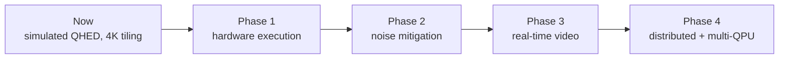

# Roadmap and future prospects

The prototype shows that tiled QHED is correct and scales linearly with image size while every
circuit stays small (5-9 qubits). The roadmap moves it from simulation towards real quantum
hardware and production workloads. Each phase builds on an extension point that already
exists, so none of them requires a redesign.

## Phase 1: Hardware execution

**Goal:** run tile circuits on IBM Quantum devices through Qiskit IBM Runtime.

- Implement `IBMHardwareBackend.run_tiles` in
  [`src/q_edge/backends/hardware_stub.py`](../../src/q_edge/backends/hardware_stub.py). The
  `Backend` protocol and registry are already in place, so the pipeline and UI need no changes.
- Transpile once per device and tile size. Bind the amplitudes per tile through a parameterised
  state-preparation template.
- Submit tiles with `SamplerV2` inside a `Batch` session, and reuse the shot-to-magnitude
  conversion that the Aer shot path already implements.
- Handle queueing: asynchronous job submission, progress from job status, and resuming partial
  results.
- Read credentials only from the local Qiskit account store, never from the repository.

**Exit criteria:** a 64x64 image on real hardware, with F1 against the simulator reported per
device.

## Phase 2: Noise mitigation and cheaper circuits

**Goal:** make hardware results usable.

- **Readout-error mitigation** (M3 or TREX), which matters because QHED reads out every
  difference amplitude.
- **Zero-noise extrapolation** and **dynamical decoupling** through Runtime options.
- **Cheaper encoding.** Exact amplitude encoding needs `O(2^n)` CNOTs. Options:
  - approximate state preparation
  - FRQI or NEQR encodings
  - smaller 2x2 or 4x4 tiles on hardware, accepting more circuits
- **Ancilla-only variant.** Use the published QHED variants that measure only the ancilla
  branch, combined with post-selection, to cut the shot budget.
- **Noise-aware simulation.** Add an Aer noise-model backend from device calibration data, so
  hardware results can be predicted before spending QPU time.

**Exit criteria:** hardware F1 within 10% of the noiseless simulator on synthetic scenes.

## Phase 3: Real-time video

**Goal:** process 1080p video at interactive rates on the simulator path, as a template for
future QPU streaming.

- Frame-to-frame **tile caching**: hash each tile and recompute only the tiles that changed.
  Static backgrounds then cost nothing.
- A **GPU backend** with pinned-memory transfers and CUDA streams that overlap transfer and
  compute.
- Webcam or RTSP input in the Streamlit app, with WebRTC preview.
- Temporal smoothing of edge maps.

**Exit criteria:** at least 30 fps at 1080p on a consumer GPU, with the tile-cache hit rate
reported.

## Phase 4: Distributed and multi-QPU execution

**Goal:** scale horizontally across machines and quantum processors.

- Executor backends for **Ray** or **Dask**. Tiles are independent, and batches are already the
  unit of work.
- A **multi-QPU scheduler** that routes tile batches by queue depth, fidelity and cost.
- **Shared-memory or object-store transport** for batches instead of pickling.
- A REST/gRPC service wrapper with job IDs, so other tools can submit images.

**Exit criteria:** linear throughput scaling to 8 nodes on 4K batches.

## Research directions

- **Beyond gradients:** QHED-style circuits for Laplacian and diagonal kernels, and multi-scale
  edges from several tile sizes.
- **Learned thresholds:** a small classical head on QHED responses for better F1 on photos.
- **Benchmarking honesty:** keep publishing runtime, fidelity and cost per megapixel next to
  classical baselines as hardware improves.
- **Fault-tolerant outlook:** amplitude encoding and readout costs are the main barriers; track
  the improvements in QRAM and state preparation that change the economics.
