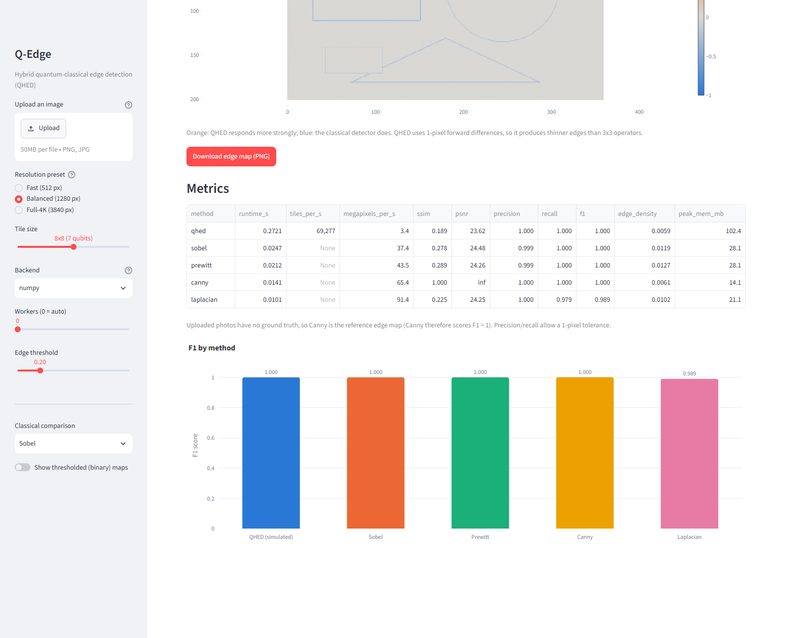
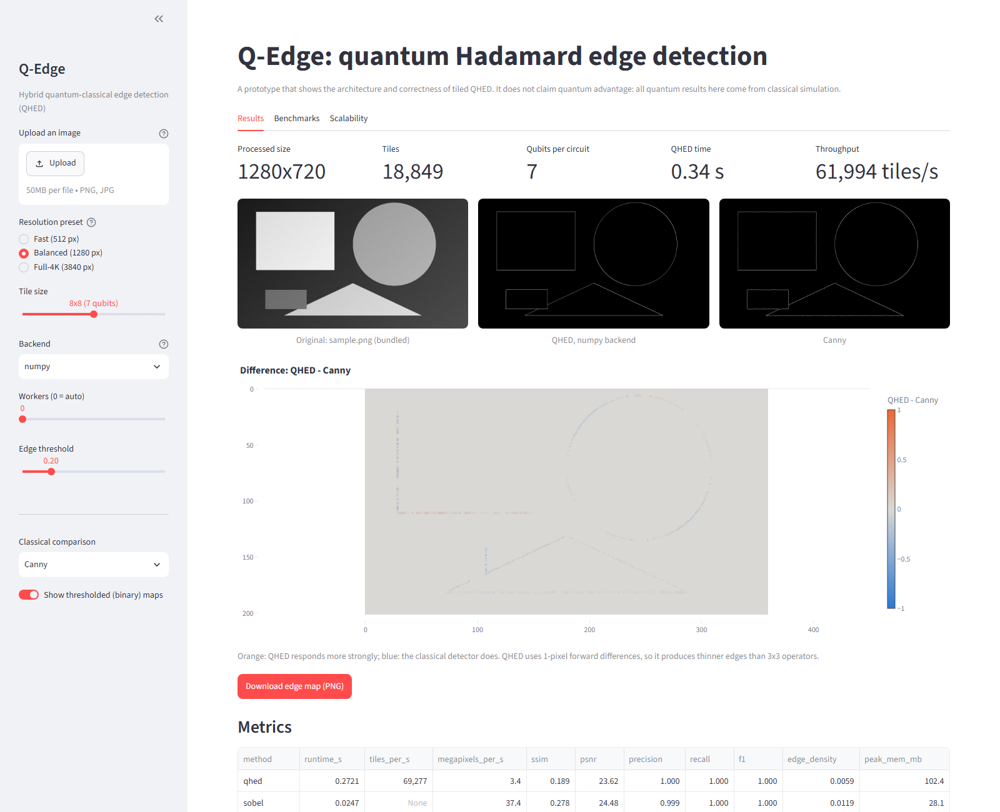
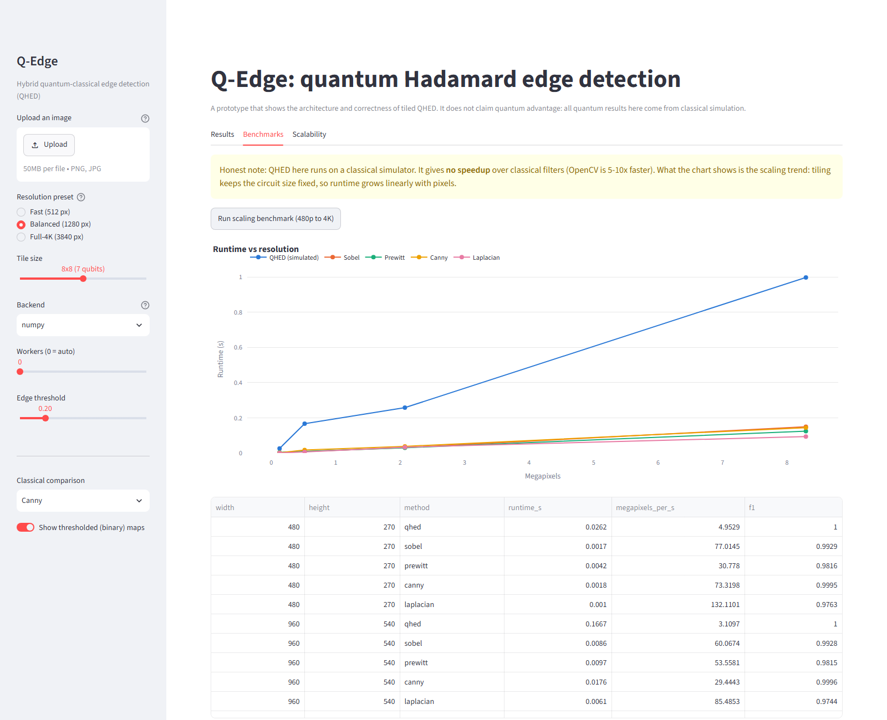
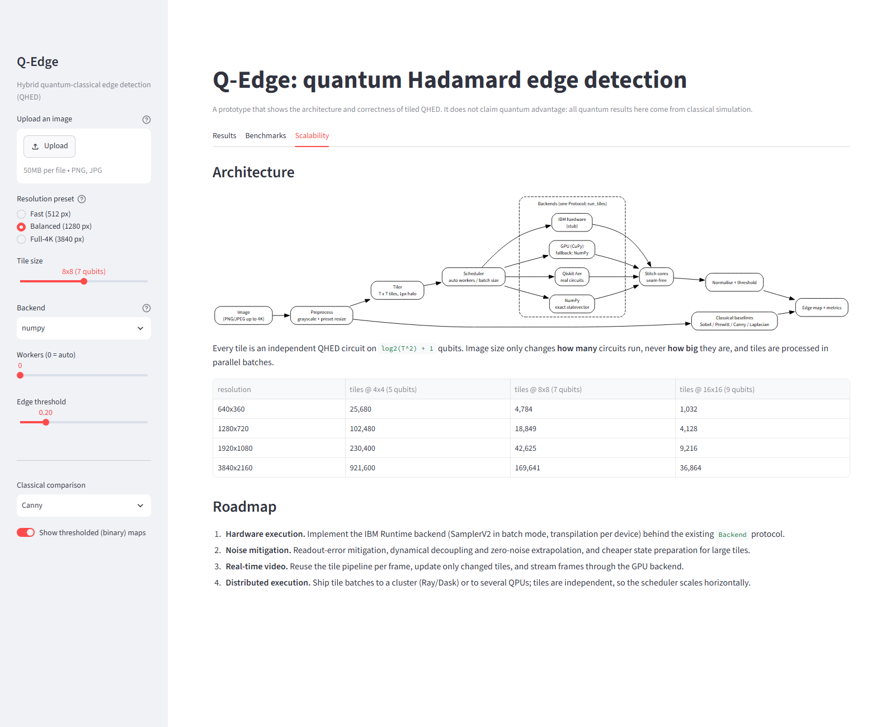
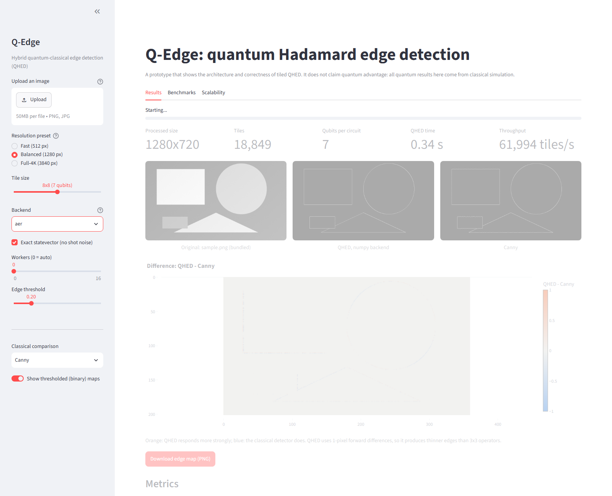
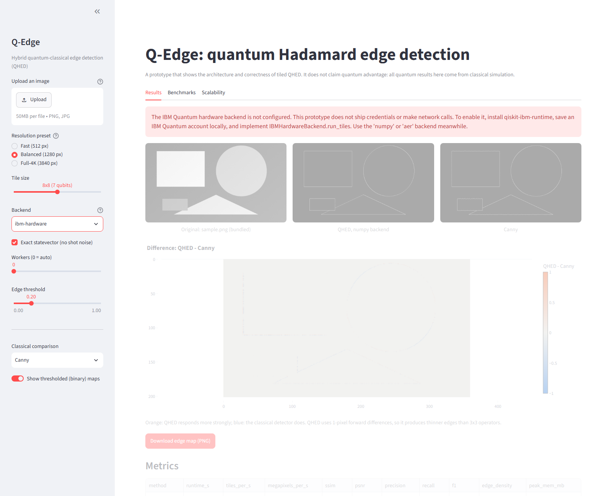

# Using Q-Edge

This guide covers installation, the Streamlit app screen by screen, the command-line demo and the
Python API. The screenshots were captured from the running app with
[`scripts/capture_screenshots.py`](../scripts/capture_screenshots.py).

## 1. Install

You need [uv](https://docs.astral.sh/uv/) and Python 3.11 or newer.

```powershell
# Windows: install uv once, then make it available in the current shell
powershell -ExecutionPolicy ByPass -c "irm https://astral.sh/uv/install.ps1 | iex"
$env:Path = "$env:USERPROFILE\.local\bin;$env:Path"

cd path\to\q-edge
uv sync            # creates .venv and installs locked dependencies
```

On macOS or Linux, install uv with `curl -LsSf https://astral.sh/uv/install.sh | sh`. All other
commands are the same.

Optional: `uv tool install rust-just` provides the `just` task runner (`just test`, `just lint`,
`just app`, `just demo`, `just cov`).

## 2. Launch the app

```bash
uv run streamlit run app/streamlit_app.py
```

Open http://localhost:8501. The server binds to `localhost` only and makes no network calls
(see [`.streamlit/config.toml`](../.streamlit/config.toml)).

## 3. Sidebar controls

| Control | Values | Effect |
|---|---|---|
| Upload an image | PNG or JPEG, at most 50 MB and 3840x2160 | Without an upload, the bundled sample `app/assets/sample.png` is used |
| Resolution preset | Fast (512 px), Balanced (1280 px), Full-4K (3840 px) | Downscales the image so its longest side fits the preset |
| Tile size | 4x4 (5 qubits), 8x8 (7 qubits), 16x16 (9 qubits) | Size of each QHED circuit; the qubit count never depends on the image size |
| Backend | `numpy`, `aer`, `gpu`, `ibm-hardware` | Execution engine (see the table below) |
| Exact statevector / Shots | Shown for `aer` and `ibm-hardware` only | Untick to simulate shot noise with the chosen number of shots |
| Workers | 0 = automatic, up to 16 | Parallel workers for tile batches |
| Edge threshold | 0.00-1.00 (default 0.20) | Cutoff for the binary edge mask |
| Classical comparison | Sobel, Prewitt, Canny, Laplacian | Detector shown beside QHED |
| Show thresholded (binary) maps | On/off | Switches between edge strength and binary masks |

| Backend | What it does | When to use it |
|---|---|---|
| `numpy` | Exact batched statevector simulation | Default; handles 4K in about 1 s |
| `aer` | Builds and runs real Qiskit circuits on Aer, one per tile and direction | To see the real circuit path; the app limits it to 64 px images and 4x4 tiles |
| `gpu` | Same math with CuPy on a CUDA device; uses NumPy if CuPy or CUDA is missing | Machines with an NVIDIA GPU and CuPy installed |
| `ibm-hardware` | Interface stub | Shows the integration point; always reports "not configured" |

## 4. Results tab


- **Stats row:** processed size, tile count, qubits per circuit, QHED wall time and throughput.
- **Three panels:** the original image, the QHED edge map and the selected classical detector.
- **Difference heatmap:** `QHED - classical`. Orange means QHED responds more strongly; blue
  means the classical detector does. QHED uses 1-pixel forward differences, so its edges are
  thinner than those of 3x3 operators.
- **Download edge map (PNG):** saves the full-resolution QHED map, in the current view
  (strength or binary).

Scrolling down shows the metrics table and the F1 chart:



The table includes runtime, tiles per second, megapixels per second, SSIM, PSNR, precision,
recall, F1, edge density and peak memory. Uploaded photos have no ground truth, so **Canny's
output serves as the reference**, which means Canny always scores F1 = 1. Precision and recall
allow a 1-pixel tolerance.

Binary masks compared against Canny:



## 5. Benchmarks tab

Press **Run scaling benchmark (480p to 4K)** to time every method on synthetic scenes at four
resolutions. The results stay in the session until the page is reloaded.



The yellow note states the honest result: the simulated quantum path is slower than OpenCV.
The chart shows that every method scales roughly linearly with pixel count. Timings vary from
run to run, especially while other processes use the CPU.

## 6. Scalability tab



This tab shows the architecture diagram, a table of tile counts per resolution and tile size
(the circuit size stays constant), and the roadmap.

## 7. Circuit backend and error states

Selecting `aer` runs real circuits. The app tells you it has downscaled the image to 64 px and
switched to 4x4 tiles:



Selecting `ibm-hardware` shows a clear configuration error instead of failing silently:



Invalid uploads are rejected with a readable message. The app rejects empty, corrupt,
truncated, unsupported, oversized and larger-than-4K files, as well as decompression bombs:


## 8. Command-line demo

```bash
uv run python scripts/demo.py             # sample image, fast vs Aer check, 4K run, benchmarks
uv run python scripts/demo.py --scaling   # adds the 480p-4K runtime sweep
uv run python scripts/demo.py --image path/to/photo.jpg
```

The demo writes the edge map to `outputs/<name>_qhed_edges.png`. Example output on the
development machine:

```
=== 2. Fast path vs real Qiskit Aer circuits (64x64 crop, 4x4 tiles) ===
max |fast - circuit| = 5.76e-12 (Aer took 13.29 s)

=== 3. Synthetic 4K frame (3840x2160) through the tiled pipeline ===
tile  8x8 : 169,641 tiles, 1.11 s, max circuit 7 qubits
tile 16x16:  36,864 tiles, 0.87 s, max circuit 9 qubits
```

## 9. Python API in five lines

```python
from q_edge.config import Preset, QEdgeConfig
from q_edge.pipeline import run_pipeline

result = run_pipeline("photo.jpg", QEdgeConfig(tile_size=8, preset=Preset.FULL_4K))
print(result.num_tiles, result.total_time, result.edges.shape)
```

See [api.md](api.md) for the full reference.

## 10. Troubleshooting

| Symptom | Fix |
|---|---|
| `uv: command not found` | Add `%USERPROFILE%\.local\bin` (Windows) or `~/.local/bin` to `PATH`, or restart the shell |
| Aer runs take 10+ seconds | Expected; Aer simulates two circuits per tile. Use `numpy` for real images |
| GPU backend shows the same speed as NumPy | CuPy or CUDA is not available, so the backend falls back to NumPy (a warning is logged) |
| Metrics show `None` under `tiles_per_s` for classical rows | Known cosmetic issue: the value is not applicable to classical methods and should display as `-` |
| Port 8501 is busy | `uv run streamlit run app/streamlit_app.py --server.port 8502` |
